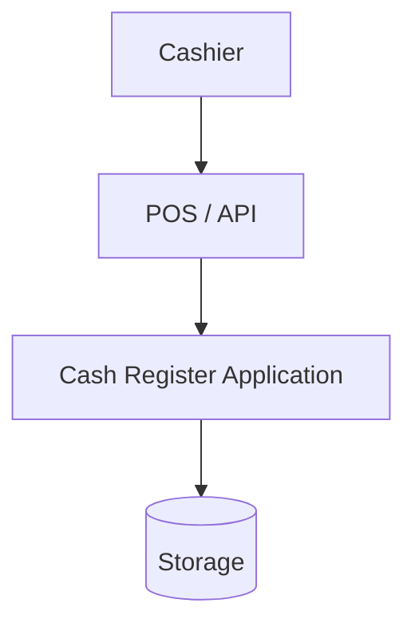
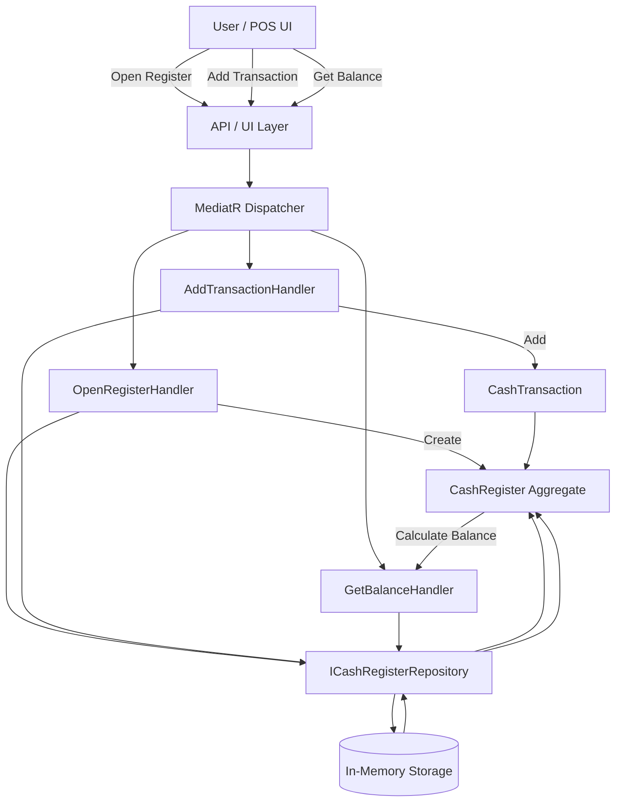
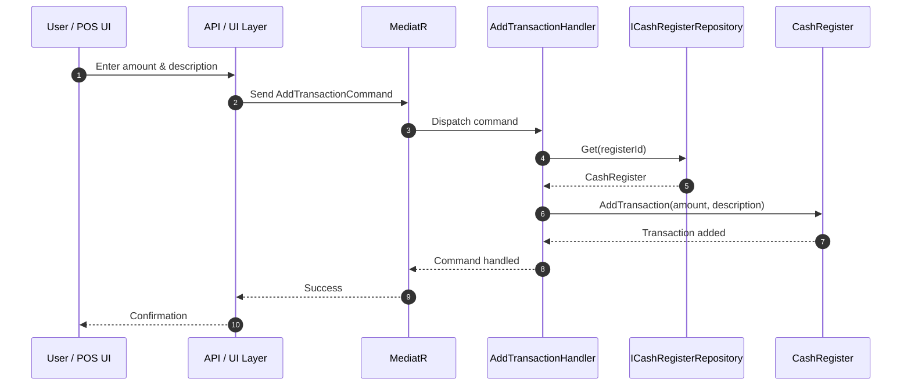

```
1. User enters a cash amount and description in the POS UI.
2. The UI sends an AddTransactionCommand to the API layer.
3. The API forwards the command to MediatR.
4. MediatR dispatches the command to AddTransactionHandler.
5. The handler retrieves the CashRegister from the repository.
6. The repository returns the CashRegister aggregate.
7. The handler calls AddTransaction on the CashRegister.
8. The CashRegister validates and stores the transaction.
9. The handler completes successfully.
10. MediatR returns success to the API.
11. The API confirms the operation to the user.
