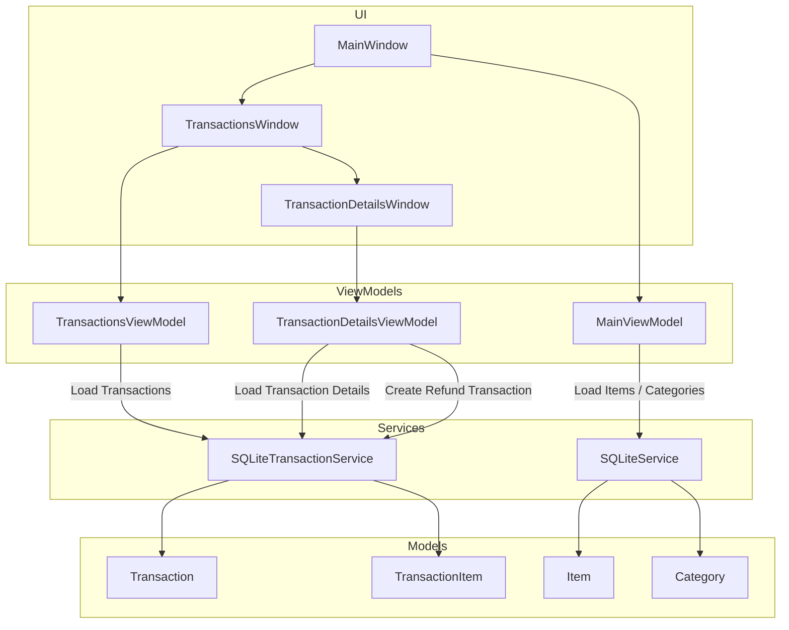
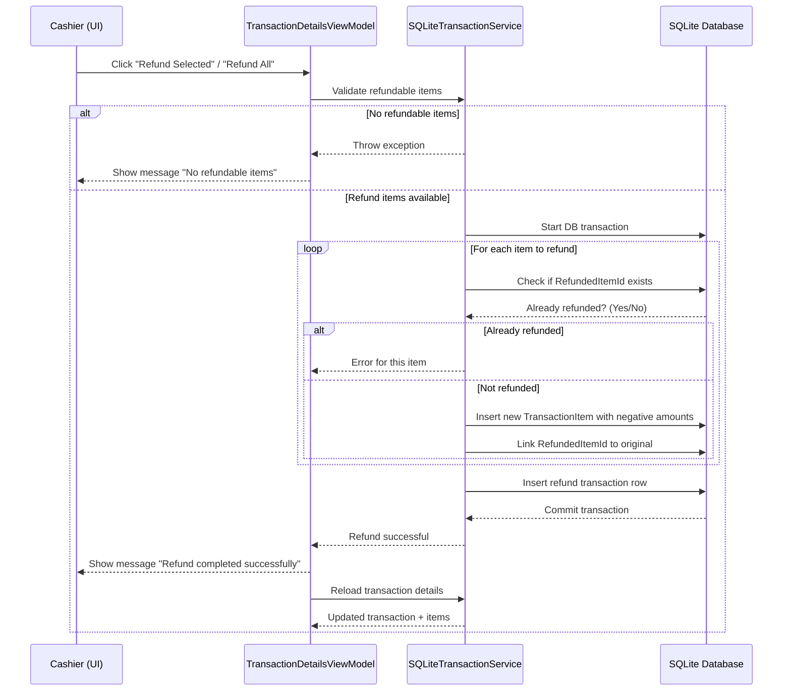

# Cash Register POS Application

A WPF-based Cash Register application built using **MVVM**, **SQLite**, and **C#**.  
Supports item-based transactions, federal/provincial taxes, partial and full refunds, and full audit tracking.

---

## Table of Contents

1. [Features](#features)  
2. [Architecture](#architecture)  
3. [Installation](#installation)  
4. [Database](#database)  
5. [Usage](#usage)  
6. [Refund Rules](#refund-rules)  
7. [Developer Notes](#developer-notes)  
8. [Contributing](#contributing)  
9. [License](#license)  

---

## Features

- MVVM-based WPF architecture  
- Item categories loaded from JSON  
- Tabbed category view with buttons for items  
- Real-time transaction total and tax calculation  
- Supports **Federal (5%)** and **Provincial (9.975%)** taxes  
- Transactions persisted in **SQLite**  
- Individual and full transaction refunds  
- Refund safety rules prevent double refunds  
- Transaction history with visual differentiation for refunds  
- Unit testing support

---

## Architecture

### Component Diagram

# Cash Register – Transactions & Refunds Rules

This document describes the **business rules, technical principles, and architectural decisions**
used for handling transactions and refunds in the Cash Register application.

The goal is to ensure **accounting correctness**, **auditability**, and **safety**.

---

## 1. Core Principles

### 1.1 Transactions Are Immutable
- Once a transaction is saved, it is **never modified**
- Refunds are implemented as **new transactions**
- This guarantees:
  - Auditability
  - Legal compliance
  - Accurate financial reporting

> ❗ Never update or delete an existing transaction or its items.

---

### 1.2 Refunds Are Transactions
A refund is a transaction with:
- Negative amounts
- A reference to the original transaction

| Field | Meaning |
|-----|--------|
| IsRefund | `true` if the transaction is a refund |
| OriginalTransactionId | Points to the original sale transaction |

---

## 2. Database Design Rules

### 2.1 Transactions Table

Each row represents:
- A sale **or**
- A refund

Refund transactions:
- Have negative totals
- Reference the original transaction

---

### 2.2 TransactionItems Table

Each row represents a **single sold or refunded item**.

Additional rule:

| Column | Purpose |
|------|--------|
| RefundedItemId | Links a refund item to the original sold item |

- Original sale items → `RefundedItemId = NULL`
- Refund items → `RefundedItemId = <Original TransactionItem Id>`

This link is **mandatory** for refund safety.

---

## 3. Tax Rules

### 3.1 Supported Taxes
- Federal (F): **5%**
- Provincial (P): **9.975%**

An item may have:
- Federal only
- Provincial only
- Both
- No tax

---

### 3.2 Tax Calculation Rule

Taxes are:
- Calculated **at time of sale**
- Stored **per item**

Stored fields:
- `FederalTaxPaid`
- `ProvincialTaxPaid`

> ❗ Taxes are **never recalculated** during refund.

---

### 3.3 Refund Tax Rule

When refunding an item:
- Refund **exactly the taxes that were originally paid**
- Store refunded taxes as **negative values**

This ensures:
- Accurate tax reporting
- Correct refunds even if tax rules change later

---

## 4. Refund Rules

### 4.1 Refund Types
The system supports:
- Full transaction refunds
- Partial (item-level) refunds
- Multiple refund transactions per sale

---

### 4.2 Refund Safety Rules (Critical)

#### Rule 1: A refund cannot be refunded
- Transactions with `IsRefund = true` cannot be refunded again

#### Rule 2: An item cannot be refunded twice
- Before refunding an item:
  - Check if any `TransactionItems.RefundedItemId` already references it
- If yes → refund is blocked

#### Rule 3: Refund All refunds only remaining items
- Already refunded items are skipped
- If no refundable items remain → operation is blocked

---

## 5. UI / UX Rules

### 5.1 Transactions List
- Shows both sales and refunds
- Refund transactions are visually distinct (e.g. red / italic)
- Refund button is disabled for refund transactions

---

### 5.2 Transaction Details Window
- Displays:
  - Transaction header
  - Item list
- Each item shows:
  - Price
  - Federal tax paid
  - Provincial tax paid

#### Refunded Items
- Are disabled
- Cannot be selected
- Are visually marked (e.g. grayed out / italic)

---

### 5.3 Refund Feedback
After a refund:
- Show confirmation message
- Reload transaction details from database
- Update refunded flags and UI state

> ❗ UI state must always be refreshed from the database, never inferred.

---

## 6. Architectural Principles

### 6.1 Single Source of Truth
- SQLite database is the only source of truth
- ViewModels reload data after any mutation

---

### 6.2 Service Responsibility
- All transaction and refund logic lives in `SQLiteTransactionService`
- ViewModels:
  - Validate intent
  - Handle UI flow
  - Show messages

---

### 6.3 MVVM Compliance
- No business logic in Views
- Commands drive all actions
- ValueConverters are used only for presentation

---

## 7. Error Handling Rules

- Refund operations must be wrapped in database transactions
- Any failure must:
  - Roll back changes
  - Display a user-friendly error message
- Integrity checks exist in both:
  - ViewModel
  - Service layer (defensive programming)

---

## 8. Why This Design

This design ensures:
- Auditability
- Legal compliance
- Accurate accounting
- Safe partial refunds
- Clear user experience

This approach mirrors **real-world POS and accounting systems**.

---

## 9. Summary

✔ Transactions are immutable  
✔ Refunds are new transactions  
✔ Taxes are stored and refunded exactly  
✔ Items cannot be refunded twice  
✔ UI always reflects database state  

This document must be kept up-to-date as the system evolves.
