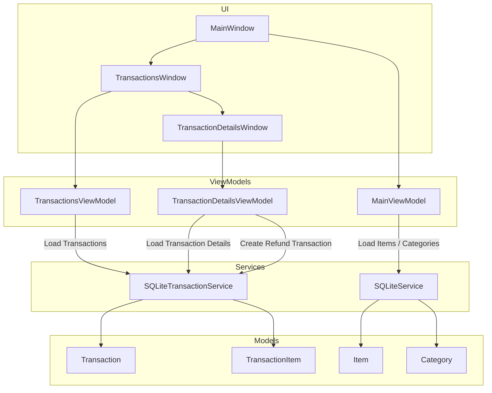
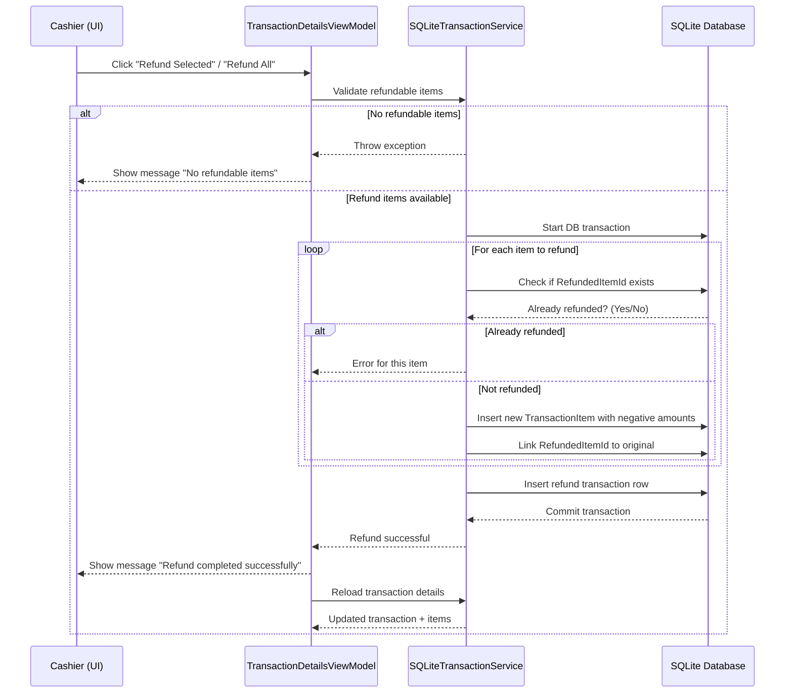

# Cash Register POS Application

A WPF-based Cash Register application built using **MVVM**, **SQLite**, and **C#**.  
Supports item-based transactions, federal/provincial taxes, partial and full refunds, and full audit tracking.

---

## Table of Contents

1. [Features](#features)  
2. [Architecture](#architecture)  
3. [Installation](#installation)  
4. [Database](#database)  
5. [Usage](#usage)  
6. [Refund Rules](#refund-rules)  
7. [Developer Notes](#developer-notes)  
8. [Contributing](#contributing)  
9. [License](#license)  

---

## Features

- MVVM-based WPF architecture  
- Item categories loaded from JSON  
- Tabbed category view with buttons for items  
- Real-time transaction total and tax calculation  
- Supports **Federal (5%)** and **Provincial (9.975%)** taxes  
- Transactions persisted in **SQLite**  
- Individual and full transaction refunds  
- Refund safety rules prevent double refunds  
- Transaction history with visual differentiation for refunds  
- Unit testing support

---

## Architecture

### Component Diagram

