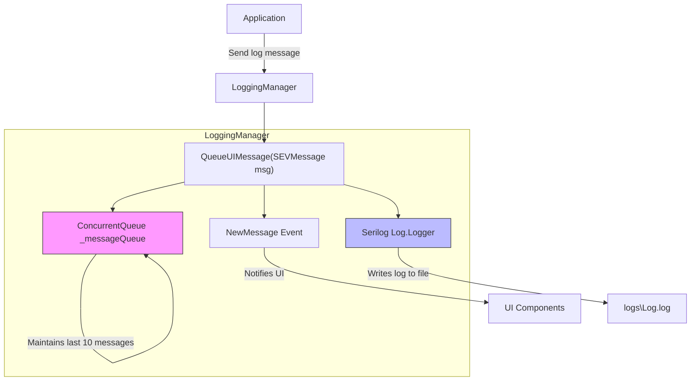

```mermaid

classDiagram
    class LoggingManager {
        <<static>>
        - ConcurrentQueue~SEVMessage~ _messageQueue
        - int MaxQueueSize = 10
        + event EventHandler~SEVMessage~ NewMessage
        + IReadOnlyCollection~SEVMessage~ MessageQueue
        + static void ErrorMessage(string msg)
        + static void WarningMessage(string msg)
        + static void InformationMessage(string msg)
        + static void ErrorMessage(string format, params object[] objs)
        + static void WarningMessage(string format, params object[] objs)
        + static void InformationMessage(string format, params object[] objs)
        + static void ExceptionMessage(Exception ex)
        + static void Error(string msg)
        + static void Warning(string msg)
        + static void Information(string msg)
        + static void Error(string format, params object[] objs)
        + static void Warning(string format, params object[] objs)
        + static void Information(string format, params object[] objs)
        + static void Exception(Exception ex)
        - static void QueueUIMessage(SEVMessage msg)
        - static void LogAndQueue(SEVMessage msg, Action~string~ logAction)
    }

    class SEVMessage {
        + string Text
        + static SEVMessage Error(string msg)
        + static SEVMessage Warning(string msg)
        + static SEVMessage Information(string msg)
        + static SEVMessage Error(string format, params object[] objs)
        + static SEVMessage Warning(string format, params object[] objs)
        + static SEVMessage Information(string format, params object[] objs)
    }

    LoggingManager "1" --> "*" SEVMessage : uses
