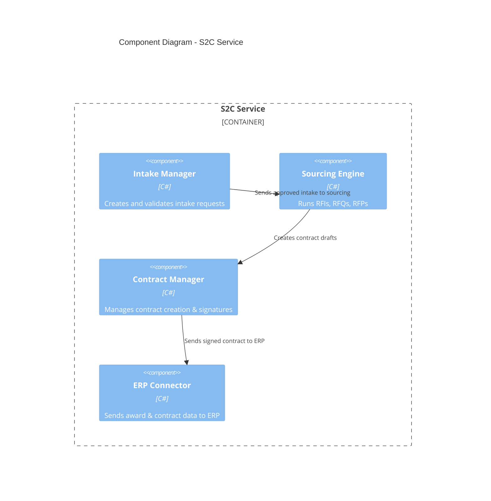
```mermaid
C4Component
    title Component Diagram - S2C Service

    Container_Boundary(s2c, "S2C Service") {
        Component(intake, "Intake Manager", "C#", "Creates and validates intake requests")
        Component(sourcing, "Sourcing Engine", "C#", "Runs RFIs, RFQs, RFPs")
        Component(contracting, "Contract Manager", "C#", "Manages contract creation & signatures")
        Component(integration, "ERP Connector", "C#", "Sends award & contract data to ERP")
    }

    Rel(intake, sourcing, "Sends approved intake to sourcing")
    Rel(sourcing, contracting, "Creates contract drafts")
    Rel(contracting, integration, "Sends signed contract to ERP")
```
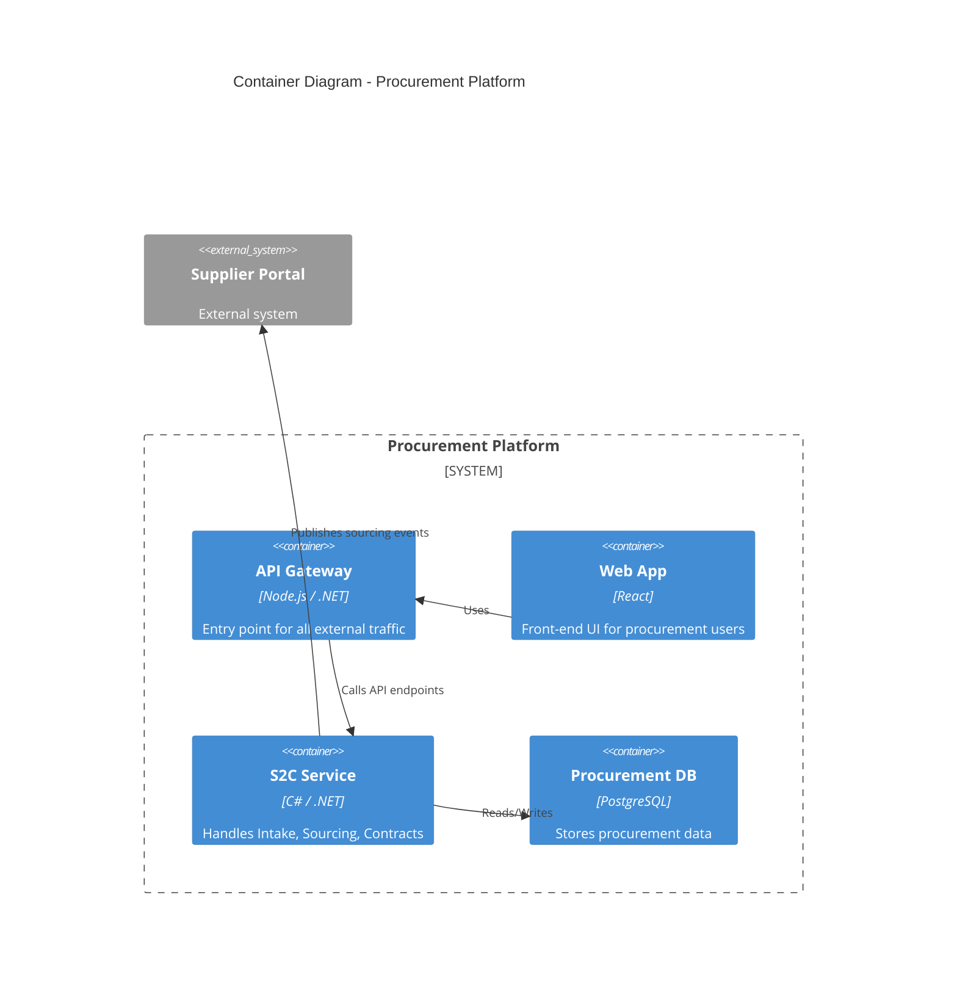
```mermaid
C4Container
    title Container Diagram - Procurement Platform

    System_Boundary(procurement,"Procurement Platform") {
        Container(api, "API Gateway", "Node.js / .NET", "Entry point for all external traffic")
        Container(web, "Web App", "React", "Front-end UI for procurement users")
        Container(svc, "S2C Service", "C# / .NET", "Handles Intake, Sourcing, Contracts")
        Container(db, "Procurement DB", "PostgreSQL", "Stores procurement data")
    }

    System_Ext(supplierPortal, "Supplier Portal", "External system")

    Rel(web, api, "Uses")
    Rel(api, svc, "Calls API endpoints")
    Rel(svc, db, "Reads/Writes")
    Rel(svc, supplierPortal, "Publishes sourcing events")
```
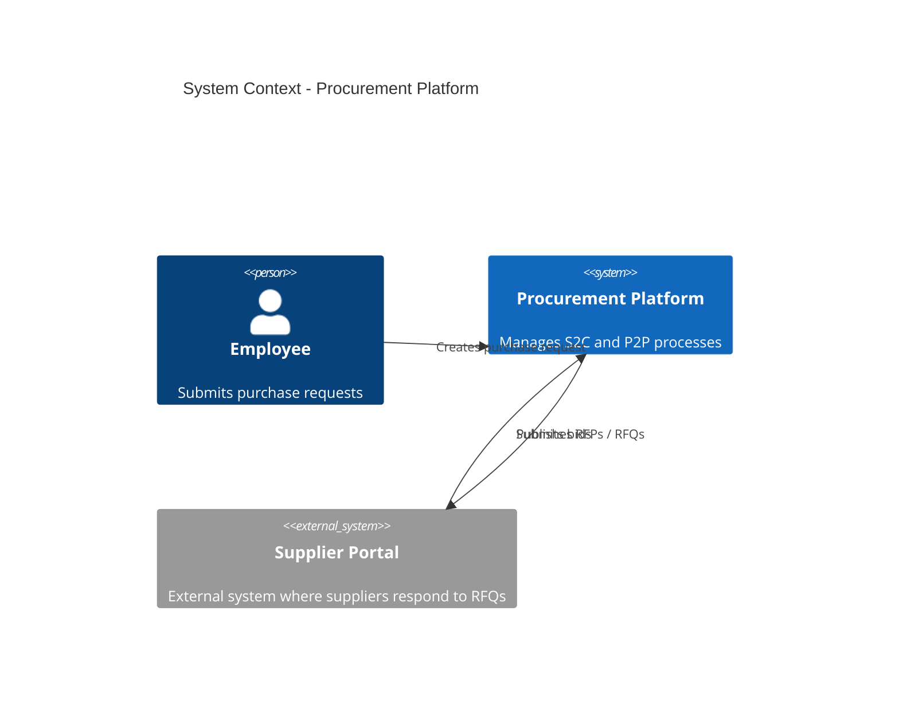
```mermaid
C4Context
    title System Context - Procurement Platform

    Person(user, "Employee", "Submits purchase requests")
    System(procurement, "Procurement Platform", "Manages S2C and P2P processes")
    System_Ext(supplier, "Supplier Portal", "External system where suppliers respond to RFQs")

    Rel(user, procurement, "Creates purchase request")
    Rel(procurement, supplier, "Publishes RFPs / RFQs")
    Rel(supplier, procurement, "Submits bids")
```
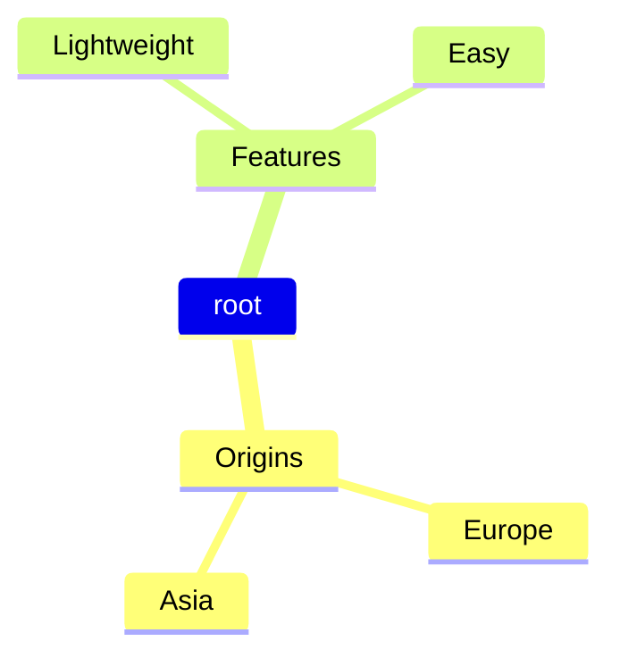
```mermaid

mindmap
  root
    Origins
      Europe
      Asia
    Features
      Lightweight
      Easy
```
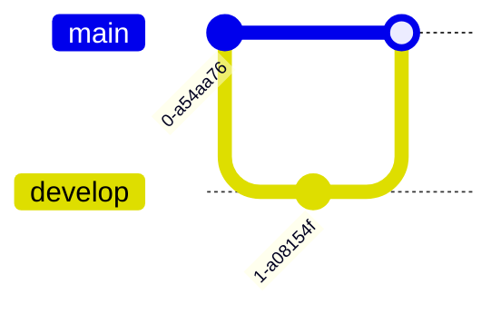
```mermaid

gitGraph
  commit
  branch develop
  commit
  checkout main
  merge develop
```
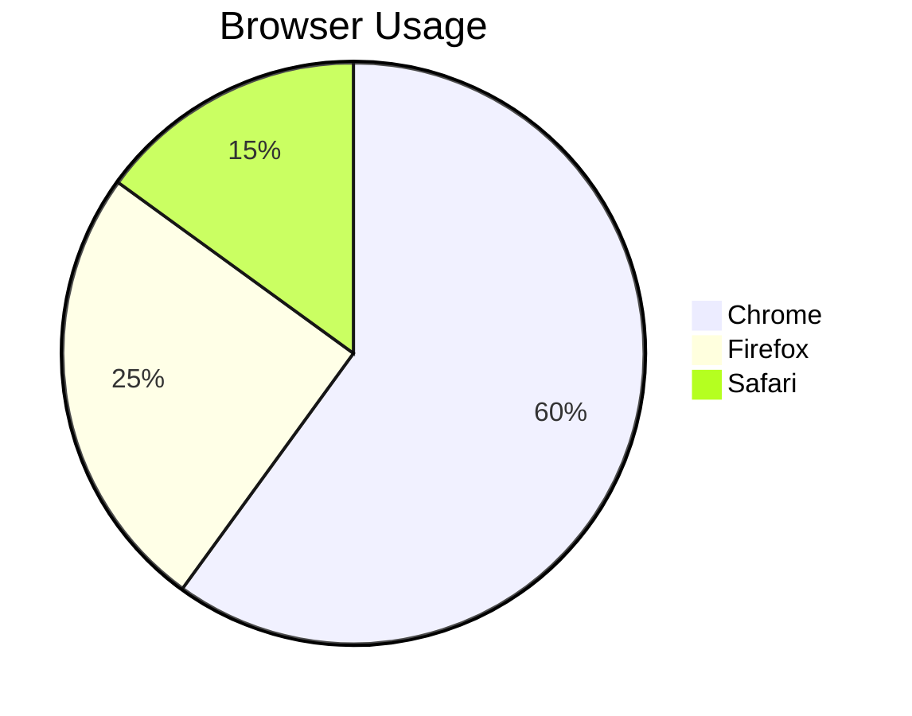
```mermaid

pie
  title Browser Usage
  "Chrome" : 60
  "Firefox" : 25
  "Safari" : 15
```
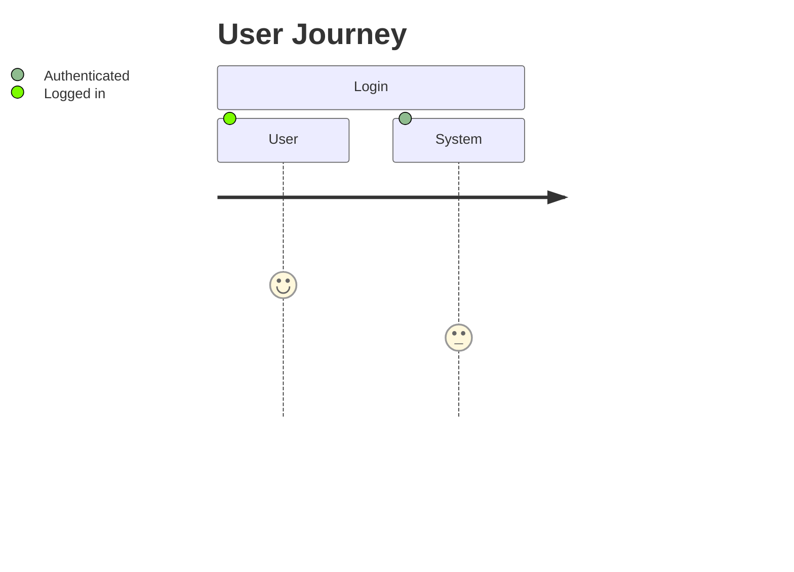
```mermaid

journey
  title User Journey
  section Login
    User: 5: Logged in
    System: 3: Authenticated
```
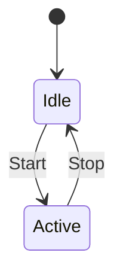
```mermaid

stateDiagram-v2
  [*] --> Idle
  Idle --> Active : Start
  Active --> Idle : Stop
```
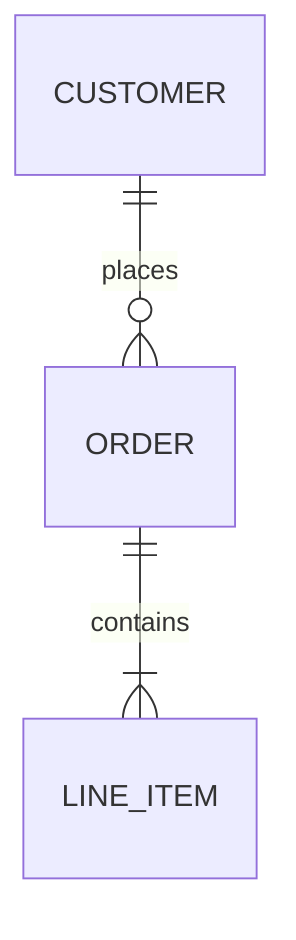
```mermaid
erDiagram
  CUSTOMER ||--o{ ORDER : places
  ORDER ||--|{ LINE_ITEM : contains
```
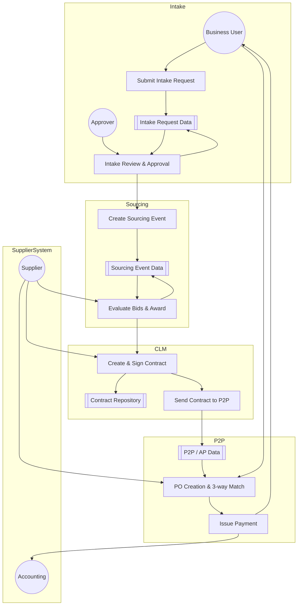
```mermaid
flowchart TD

    %% External Entities
    User((Business User))
    Supplier((Supplier))
    SupplierAccount((Accounting))
    Approver((Approver))

    %% Data Stores
    DS_Intake[[Intake Request Data]]
    DS_Sourcing[[Sourcing Event Data]]
    DS_Contract[[Contract Repository]]
    DS_P2P[[P2P / AP Data]]

    %% Processes
    P1[Submit Intake Request]
    P2[Intake Review & Approval]
    P3[Create Sourcing Event]
    P4[Evaluate Bids & Award]
    P5[Create & Sign Contract]
    P6[Send Contract to P2P]
    P7[PO Creation & 3-way Match]
    P8[Issue Payment]

    subgraph SupplierSystem
        Supplier
        SupplierAccount
    end

    subgraph P2P
        P7
        DS_P2P
        P8
    end


    %% Flows
    subgraph Intake
        User --> P1 --> DS_Intake
        DS_Intake --> P2
        Approver --> P2 --> DS_Intake
    end

    subgraph Sourcing
        P2 --> P3 --> DS_Sourcing
        DS_Sourcing --> P4 --> DS_Sourcing
    end

    subgraph CLM
        P4 --> P5 --> DS_Contract
        P5 --> P6 --> DS_P2P
    end


    subgraph SupplierSystem
        Supplier --> P7
        Supplier --> P5
        Supplier --> P4
    end


    subgraph P2P
        User --> P7
        DS_P2P --> P7 --> P8
        P8 --> User
        P8 --> SupplierAccount
    end
```

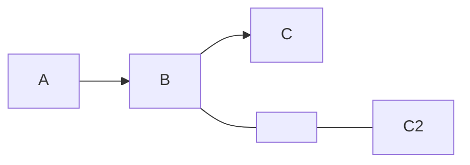
```mermaid

graph LR
    A --> B
    B --> C
    B --- H[ ] --- C2[C2]
```
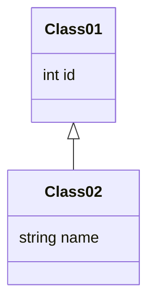
```mermaid
classDiagram
  Class01 <|-- Class02
  Class01 : int id
  Class02 : string name
```
