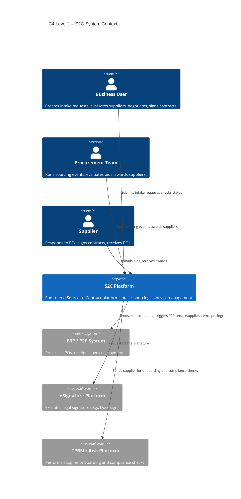

```mermaid

C4Context
    title C4 Level 1 – S2C System Context

    Person(buyer, "Business User", "Creates intake requests, evaluates suppliers, negotiates, signs contracts.")
    Person(procTeam, "Procurement Team", "Runs sourcing events, evaluates bids, awards suppliers.")
    Person(supplier, "Supplier", "Responds to RFx, signs contracts, receives POs.")

    System(s2c, "S2C Platform", "End-to-end Source-to-Contract platform: intake, sourcing, contract management.")

    System_Ext(erp, "ERP / P2P System", "Processes POs, receipts, invoices, payments.")
    System_Ext(sig, "eSignature Platform", "Executes legal signature (e.g., DocuSign).")
    System_Ext(risk, "TPRM / Risk Platform", "Performs supplier onboarding and compliance checks.")

    Rel(buyer, s2c, "Submits intake requests, checks status")
    Rel(procTeam, s2c, "Runs sourcing events, awards suppliers")
    Rel(supplier, s2c, "Uploads bids, receives awards")

    Rel(s2c, erp, "Sends contract data → triggers P2P setup (supplier, items, pricing)")
    Rel(s2c, sig, "Requests digital signature")
    Rel(s2c, risk, "Sends supplier for onboarding and compliance checks")

```
