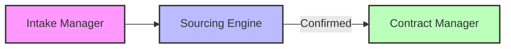
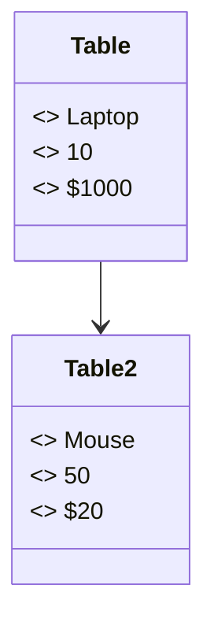
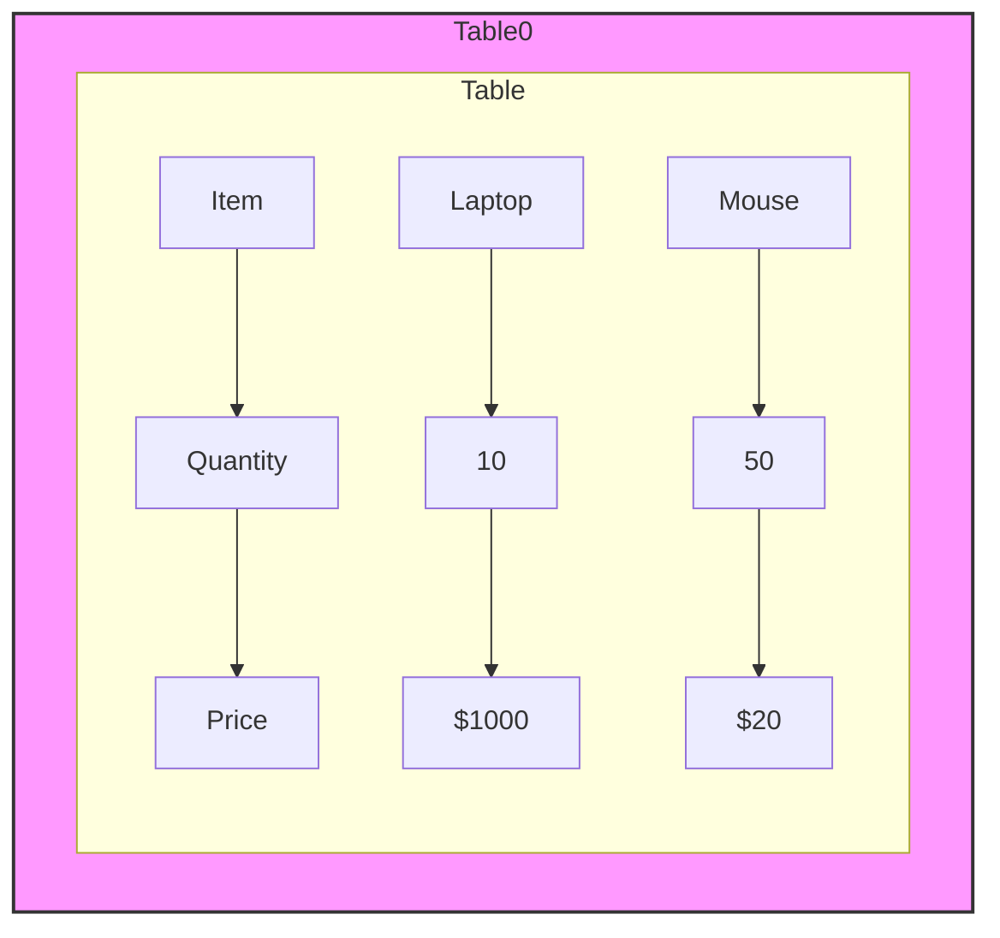
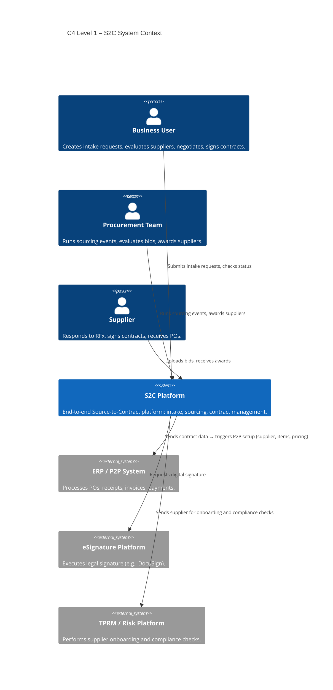

```mermaid

flowchart LR
    A[Intake Manager] --> B[Sourcing Engine]
    B --> |Confirmed| C[Contract Manager]

    %% Style nodes
    style A fill:#f9f,stroke:#333,stroke-width:2px
    style B fill:#bbf,stroke:#333,stroke-width:2px
    style C fill:#bfb,stroke:#333,stroke-width:2px


```

```mermaid
classDiagram
    class Table {
        <<Item>> Laptop
        <<Quantity>> 10
        <<Price>> $1000
    }
    class Table2 {
        <<Item>> Mouse
        <<Quantity>> 50
        <<Price>> $20
    }

Table-->Table2
```

```mermaid

flowchart TB
    subgraph Table0
        subgraph Table
            A1["Item"] --> A2["Quantity"] --> A3["Price"]
            B1["Laptop"] --> B2["10"] --> B3["$1000"]
            C1["Mouse"] --> C2["50"] --> C3["$20"]
        end
    end

    %% Style nodes
    style Table0 fill:#f9f,stroke:#333,stroke-width:2px

```

```mermaid

C4Context
    title C4 Level 1 – S2C System Context

    Person(buyer, "Business User", "Creates intake requests, evaluates suppliers, negotiates, signs contracts.")
    Person(procTeam, "Procurement Team", "Runs sourcing events, evaluates bids, awards suppliers.")
    Person(supplier, "Supplier", "Responds to RFx, signs contracts, receives POs.")

    System(s2c, "S2C Platform", "End-to-end Source-to-Contract platform: intake, sourcing, contract management.")

    System_Ext(erp, "ERP / P2P System", "Processes POs, receipts, invoices, payments.")
    System_Ext(sig, "eSignature Platform", "Executes legal signature (e.g., DocuSign).")
    System_Ext(risk, "TPRM / Risk Platform", "Performs supplier onboarding and compliance checks.")

    Rel(buyer, s2c, "Submits intake requests, checks status")
    Rel(procTeam, s2c, "Runs sourcing events, awards suppliers")
    Rel(supplier, s2c, "Uploads bids, receives awards")

    Rel(s2c, erp, "Sends contract data → triggers P2P setup (supplier, items, pricing)")
    Rel(s2c, sig, "Requests digital signature")
    Rel(s2c, risk, "Sends supplier for onboarding and compliance checks")

```
