```mermaid
%%{init: {"flowchart":{"nodeSpacing":100,"rankSpacing":100}}}%%
flowchart LR
    Start([Start]) --> Intake([Intake Request])
    Intake --> Approval([Approval Process])
    Approval --> Sourcing([Sourcing Event])
    Sourcing --> Contract([Contract Draft])
    Contract --> Signature([Signature Workflow])
    Signature --> P2P([P2P Integration])
    P2P --> End([End])

```

# Numbered Description of the Level-3 S2C Sequence Diagram

## **1–3. Intake Request Submission**
1. The Requestor fills out the intake form in the Intake UI.  
2. The UI sends the request to the Intake API, including the need description, category, and justification.  
3. The Intake API validates the category with the Supplier Master Data service.

## **4–6. Intake Creation & Approval**
4. The Supplier Master returns a valid response.  
5. The Intake API returns the newly created Intake ID to the UI.  
6. The Intake API triggers internal approval rules (e.g., budget thresholds).

## **7–8. Additional Information (Optional)**
7. The Intake API may request missing or clarifying details from the Requestor.  
8. The Requestor submits the additional details needed to complete the intake.

## **9. Intake Approval**
9. The Intake API finalizes and approves the intake request.

## **10–11. Transfer to Sourcing**
10. The Intake API sends the approved request and requirements to the Sourcing API.  
11. The Sourcing API confirms that a sourcing event has been created.

## **12–13. Supplier Discovery**
12. The Sourcing API queries the Supplier Master to retrieve eligible suppliers by category.  
13. The Supplier Master returns the list of suppliers.

## **14–16. RFx Creation & Distribution**
14. The Sourcing system constructs the RFx package.  
15. The Sourcing system prepares supplier invitations.  
16. Invitations are sent to suppliers (email or portal notification).

## **17. Bid Submission**
17. Suppliers submit their bids to the Sourcing API.

## **18. Bid Evaluation**
18. The Sourcing system evaluates and scores the bids (price, compliance, delivery).

## **19–20. Contract Drafting**
19. The Sourcing system sends the award information to the Contract API to create a draft contract.  
20. The Contract API responds with the draft contract.

## **21–22. Signature Process Initiation**
21. The Contract API sends the draft contract to the eSignature provider.  
22. The eSignature provider returns a signing link or envelope ID.

## **23–25. Signature Completion**
23. The Requestor signs the contract using the eSignature platform.  
24. The eSignature provider notifies the Contract API of completion.  
25. The Contract API updates the contract status to *Signed*.

## **26–27. Contract Push to P2P**
26. The Contract API sends contract data (pricing, supplier, terms) to the P2P system.  
27. The P2P system confirms activation of the contract.

## **28–29. PO Creation & Receipt**
28. The P2P system notifies the Requestor that a Purchase Order has been created.  
29. The Requestor confirms receipt of goods or services.

## **30–31. 3-Way Match & Payment**
30. The P2P system sends receipt and PO information to Accounts Payable for 3-way match.  
31. Accounts Payable confirms payment has been processed and notifies the Requestor.

